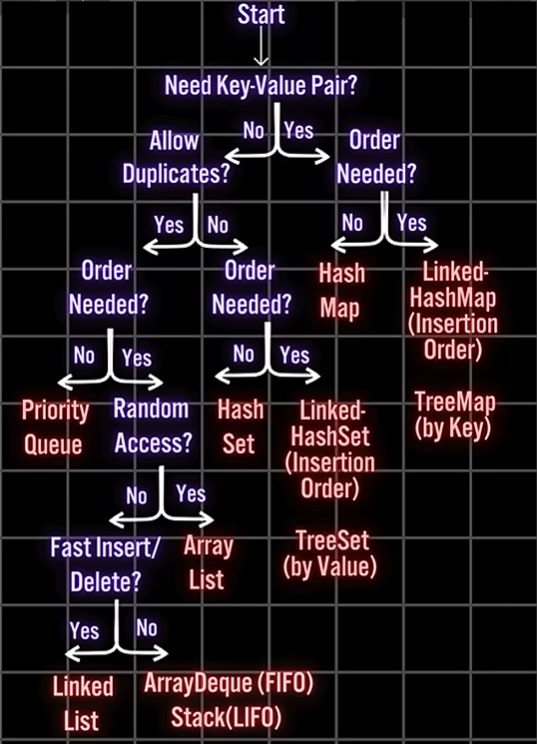

# Collections en Java 

**Auteur : A. Larhlimi**

*Destiné aux étudiants de 4 IIR - EMSI Casablanca*

***

## Introduction

Le framework des Collections en Java est un ensemble d'interfaces, classes et algorithmes permettant de stocker, manipuler et gérer des groupes d'objets.

Il joue un rôle crucial pour les ingénieurs informaticiens, car il offre des structures de données efficaces et réutilisables pour résoudre des problèmes complexes de gestion de données.

Comprendre ces collections permet d'écrire des programmes plus performants, maintenables et adaptés aux besoins réels.

***

## Hiérarchie des Interfaces des Collections en Java

Le framework Collections repose sur une architecture hiérarchique d'interfaces :

- **Collection** : Interface de base pour les groupes d'éléments.
- **List** : Liste ordonnée pouvant accepter des doublons.
- **Set** : Ensemble d'éléments uniques, sans ordre précis.
- **Queue** : File d'attente, gestion FIFO (First In First Out).
- **Map** : Association clé-valeur, pour un accès rapide via des clés.

Diagramme simplifié :




*Schéma de sélection des collections Java*


## Interface List

L'interface List représente une collection ordonnée permettant des opérations précises sur les indices, et peut contenir des doublons.

Caractéristiques principales :

- Maintient l'ordre d'insertion.
- Permet l'accès par position (index).
- Supporte les éléments en double.

Implémentations courantes : ArrayList, LinkedList.

***

## ArrayList - Partie 1

### Définition

ArrayList est une implémentation dynamique de tableau redimensionnable. Elle ajuste automatiquement sa capacité quand des éléments sont ajoutés ou supprimés.

### Avantages

- Accès rapide en lecture grâce aux indices.
- Redimensionnement automatique.


### Inconvénients

- L'ajout/suppression en milieu de liste peut être coûteux (décalage des éléments).
- Plus gourmand en mémoire que les tableaux simples.


### Complexité algorithmique

- Accès : O(1)
- Ajout en fin : amorti O(1)
- Ajout/suppression au milieu : O(n)

***

## ArrayList - Partie 2

### Exemple de projet : Gestion d'une collection de Livres

**Descriptif :**
Ce projet simule la gestion d’une petite bibliothèque. Chaque livre est représenté par une classe et stocké dans une ArrayList. Le gestionnaire permet d’ajouter des livres et d’afficher la collection, illustrant l’utilisation pratique d’une ArrayList pour organiser et parcourir des objets.

```java
import java.util.ArrayList;

public class Livre {
    private String titre;
    private String auteur;
    private int annee;

    public Livre(String titre, String auteur, int annee) {
        this.titre = titre;
        this.auteur = auteur;
        this.annee = annee;
    }

    public String getTitre() { return titre; }
    public String getAuteur() { return auteur; }
    public int getAnnee() { return annee; }

    @Override
    public String toString() {
        return "Livre{" +
               "titre='" + titre + '\'' +
               ", auteur='" + auteur + '\'' +
               ", annee=" + annee +
               '}';
    }
}

class GestionBibliotheque {
    private ArrayList<Livre> livres;

    public GestionBibliotheque() {
        livres = new ArrayList<>();
    }

    public void ajouterLivre(Livre livre) {
        livres.add(livre);
    }

    public void afficherLivres() {
        for(Livre l : livres) {
            System.out.println(l);
        }
    }

    public static void main(String[] args) {
        GestionBibliotheque gb = new GestionBibliotheque();
        gb.ajouterLivre(new Livre("L'Étranger", "Albert Camus", 1942));
        gb.ajouterLivre(new Livre("1984", "George Orwell", 1949));
        gb.afficherLivres();
    }
}
```


***

## LinkedList - Partie 1

### Définition

LinkedList est une structure de données en liste chaînée doublement liée permettant des insertions et suppressions efficientes au début, à la fin et au milieu de la liste.

### Comparaison avec ArrayList

- **LinkedList**
    - Meilleure pour insertions ou suppressions fréquentes au milieu.
    - Accès lent par index (O(n)).
- **ArrayList**
    - Meilleur accès aléatoire rapide (O(1)).
    - Insertions/suppressions coûteuses au milieu.

***

## LinkedList - Partie 2

### Exemple de projet : Gestion de Tâches

**Descriptif :**
Ce projet met en œuvre la gestion d’une liste de tâches à accomplir. Chaque tâche est un objet, pouvant être marquée comme terminée. La LinkedList permet d’ajouter, parcourir et terminer la première tâche facilement, montrant son efficacité pour manipuler des listes dont l’ordre d’exécution importe.

```java
import java.util.LinkedList;

public class Tache {
    private String description;
    private boolean estComplete;

    public Tache(String description) {
        this.description = description;
        this.estComplete = false;
    }

    public String getDescription() { return description; }
    public boolean estComplete() { return estComplete; }
    public void terminer() { estComplete = true; }

    @Override
    public String toString() {
        return "Tache{" + "description='" + description + '\'' + ", estComplete=" + estComplete + '}';
    }
}

class GestionTaches {
    private LinkedList<Tache> taches = new LinkedList<>();

    public void ajouterTache(Tache tache) {
        taches.add(tache);
    }

    public void terminerPremiereTache() {
        if (!taches.isEmpty()) {
            taches.getFirst().terminer();
        }
    }

    public void afficherTaches() {
        for (Tache t : taches) {
            System.out.println(t);
        }
    }

    public static void main(String[] args) {
        GestionTaches gt = new GestionTaches();
        gt.ajouterTache(new Tache("Faire les devoirs"));
        gt.ajouterTache(new Tache("Préparer la présentation"));
        gt.terminerPremiereTache();
        gt.afficherTaches();
    }
}
```


### Quiz sur les Listes (ArrayList et LinkedList)

1. Quelle implémentation offre un accès en temps constant par index ?
2. Quelles sont les complexités d'ajout au milieu d'un ArrayList vs LinkedList ?
3. Quelle structure utilise des pointeurs pour gérer les éléments ?
4. Peut-on insérer des doublons dans une List ?
5. Quelles sont les différences majeures entre ArrayList et LinkedList ?

***

## Interface Set

Un Set est une collection qui ne contient pas de doublons.

Caractéristiques :

- Ne garantit pas l'ordre des éléments.
- Ne peut contenir qu'une seule occurrence d'un élément donné.

Implémentations courantes : HashSet, LinkedHashSet, TreeSet.

***

## HashSet - Partie 1

### Définition

HashSet est basé sur une table de hachage utilisant les méthodes hashCode() et equals() pour garantir l'unicité des éléments.

### Fonctionnement

- Lorsqu'un élément est ajouté, son hashCode est calculé pour déterminer la position dans la table.
- En cas de collision, equals() est utilisé pour vérifier l'égalité entre éléments.

Cette structure offre un accès rapide (en moyenne O(1)) pour ajout, recherche et suppression.

***

## HashSet - Partie 2

### Exemple de projet : Gestion des Étudiants

**Descriptif :**
Ce projet illustre la gestion d’un ensemble d’étudiants dans une promotion en utilisant un HashSet. Chaque étudiant est identifié par son nom et son numéro. L’exemple démontre la nécessité de redéfinir equals() et hashCode() pour garantir l’unicité, évitant ainsi les doublons lors des ajouts.

```java
import java.util.HashSet;
import java.util.Objects;

public class Etudiant {
    private String nom;
    private int numero;

    public Etudiant(String nom, int numero) {
        this.nom = nom;
        this.numero = numero;
    }

    // Getters
    public String getNom() { return nom; }
    public int getNumero() { return numero; }

    @Override
    public boolean equals(Object o) {
        if (this == o) return true;
        if (o == null || getClass() != o.getClass()) return false;
        Etudiant etudiant = (Etudiant) o;
        return numero == etudiant.numero && nom.equals(etudiant.nom);
    }

    @Override
    public int hashCode() {
        return Objects.hash(nom, numero);
    }

    @Override
    public String toString() {
        return "Etudiant{" + "nom='" + nom + '\'' + ", numero=" + numero + '}';
    }
}

class GestionEtudiants {
    private HashSet<Etudiant> etudiants = new HashSet<>();

    public void ajouterEtudiant(Etudiant e) {
        etudiants.add(e);
    }

    public void afficherEtudiants() {
        for (Etudiant e : etudiants) {
            System.out.println(e);
        }
    }

    public static void main(String[] args) {
        GestionEtudiants ge = new GestionEtudiants();
        ge.ajouterEtudiant(new Etudiant("Ali", 101));
        ge.ajouterEtudiant(new Etudiant("Sara", 102));
        ge.ajouterEtudiant(new Etudiant("Ali", 101)); // Duplicate
        ge.afficherEtudiants();
    }
}
```


***

## LinkedHashSet

### Définition

LinkedHashSet est une extension de HashSet qui maintient l'ordre d'insertion des éléments.

### Exemple court

**Descriptif :**
Cet exemple simple montre comment LinkedHashSet garantit l'unicité des éléments tout en gardant l'ordre dans lequel ils sont ajoutés.

```java
import java.util.LinkedHashSet;

public class ExempleLinkedHashSet {
    public static void main(String[] args) {
        LinkedHashSet<String> noms = new LinkedHashSet<>();
        noms.add("Ali");
        noms.add("Sara");
        noms.add("Ali"); // Ignoré

        for (String nom : noms) {
            System.out.println(nom);
        }
    }
}
```


***

## TreeSet - Partie 1

### Définition

TreeSet implémente l'interface Set en utilisant un arbre binaire de recherche équilibré (Red-Black Tree).

### Ordre naturel

Les éléments doivent implémenter l'interface Comparable pour définir un ordre naturel.

### Ordre personnalisé

On peut définir un Comparator pour personnaliser l'ordre.

***

## TreeSet - Partie 2

### Exemple avec l'interface Comparable

**Descriptif :**
Ce projet présente une collection ordonnée de personnes selon leur nom. Chaque personne est stockée dans un TreeSet, qui utilise l’ordre naturel défini par l’interface Comparable. Il met en avant la gestion automatique de l’ordre et l’élimination des doublons par le TreeSet.

```java
import java.util.TreeSet;

public class Personne implements Comparable<Personne> {
    private String nom;
    private int age;

    public Personne(String nom, int age) {
        this.nom = nom;
        this.age = age;
    }

    @Override
    public int compareTo(Personne p) {
        return this.nom.compareTo(p.nom);
    }

    @Override
    public String toString() {
        return nom + " (" + age + " ans)";
    }

    public static void main(String[] args) {
        TreeSet<Personne> personnes = new TreeSet<>();
        personnes.add(new Personne("Alice", 30));
        personnes.add(new Personne("Bob", 25));
        personnes.add(new Personne("Claire", 28));

        for (Personne p : personnes) {
            System.out.println(p);
        }
    }
}
```


***

## TreeSet - Partie 3

### Exemple avec un Comparator

**Descriptif :**
Ici, la collection de personnes est triée par âge grâce à un Comparator personnalisé dans le TreeSet. Cet exemple montre comment adapter l’ordre de tri des éléments selon les critères choisis, en personnalisant la logique de comparaison.

```java
import java.util.TreeSet;
import java.util.Comparator;

public class Personne {
    private String nom;
    private int age;

    public Personne(String nom, int age) {
        this.nom = nom;
        this.age = age;
    }

    @Override
    public String toString() {
        return nom + " (" + age + " ans)";
    }

    public static void main(String[] args) {
        Comparator<Personne> ageComparator = new Comparator<Personne>() {
            @Override
            public int compare(Personne p1, Personne p2) {
                return Integer.compare(p1.age, p2.age);
            }
        };

        TreeSet<Personne> personnes = new TreeSet<>(ageComparator);
        personnes.add(new Personne("Alice", 30));
        personnes.add(new Personne("Bob", 25));
        personnes.add(new Personne("Claire", 28));

        for (Personne p : personnes) {
            System.out.println(p);
        }
    }
}
```


### Quiz sur les Sets (HashSet, LinkedHashSet, TreeSet)

1. Quelle est la différence fondamentale entre HashSet et TreeSet ?
2. Comment TreeSet maintient-il l'ordre des éléments ?
3. Que doit implémenter une classe pour être ajoutée dans un TreeSet ?
4. Quelle méthode est utilisée par HashSet pour gérer l'unicité ?
5. Quel est l'avantage de LinkedHashSet par rapport à HashSet ?

***

## Interface Queue

Une Queue est une collection qui suit le principe FIFO (First In First Out).

Caractéristiques :

- L'insertion se fait à la fin.
- La suppression se fait au début.

Implémentations courantes : PriorityQueue, ArrayDeque.

***

## PriorityQueue

### Définition

PriorityQueue est une implémentation de Queue où les éléments sont ordonnés selon leur priorité.

### Exemple

**Descriptif :**
Cet exemple montre comment les éléments d’une PriorityQueue sont triés selon leur ordre naturel. Chaque retrait se fait sur l’élément de plus haute priorité, ici l’entier le plus petit.

```java
import java.util.PriorityQueue;

public class ExemplePriorityQueue {
    public static void main(String[] args) {
        PriorityQueue<Integer> pq = new PriorityQueue<>();
        pq.add(30);
        pq.add(10);
        pq.add(20);

        while (!pq.isEmpty()) {
            System.out.println(pq.poll()); // Affiche dans l'ordre croissant
        }
    }
}
```


***

## Interface Deque

Deque (double-ended queue) permet d'insérer et supprimer des éléments aux deux extrémités de la file.

Caractéristiques :

- Peut fonctionner en mode FIFO ou LIFO
- Plus flexible qu'une Queue standard

***

## ArrayDeque

### Définition

ArrayDeque est une implémentation optimisée de Deque basée sur un tableau dynamique circulaire.

### Exemple

**Descriptif :**
Ce projet illustre l’usage d’une file doublement terminée. On insère et retire des éléments aux deux extrémités, ce qui est efficace pour implémenter des structures comme les piles (LIFO) ou files (FIFO).

```java
import java.util.ArrayDeque;

public class ExempleArrayDeque {
    public static void main(String[] args) {
        ArrayDeque<String> adq = new ArrayDeque<>();
        adq.addFirst("Premier");
        adq.addLast("Dernier");

        System.out.println(adq.pollFirst()); // Premier
        System.out.println(adq.pollLast()); // Dernier
    }
}
```


### Quiz sur les Queues et Deques

1. Quelle est la principale différence entre Queue et Deque ?
2. Quel mode de fonctionnement Deque permet-il en plus ?
3. Comment s'appelle la méthode pour insérer en début de Deque ?
4. Quel est l'avantage d'ArrayDeque par rapport à LinkedList comme Queue ?
5. PriorityQueue maintient-elle l'ordre d'insertion ?

***

## Interface Map

Map est une collection qui associe une clé à une valeur. Chaque clé est unique.

Caractéristiques :

- Accès rapide via la clé.
- Peut contenir des valeurs nulles et/ou des clés nulles (selon implémentation).

Implémentations courantes : HashMap, LinkedHashMap, TreeMap.

***

## HashMap - Partie 1

### Définition

HashMap utilise une table de hachage pour stocker les paires clés-valeurs.

### Fonctionnement

- Calcule le hashCode de la clé pour déterminer le compartiment.
- Stocke la valeur associée à la clé.

Avantages : accès rapide (moyenne O(1)) pour insertion, suppression, recherche.

***

## HashMap - Partie 2

### Exemple de projet : Association Employé-Projet

**Descriptif :**
Ce projet gère l’attribution de projets à des employés dans une entreprise via une HashMap. Chaque employé est associé à un projet spécifique, permettant un accès rapide à cette relation clé-valeur. Il met en évidence l’utilité de HashMap pour stocker des associations personnalisées et assurer l’unicité des clés.

```java
import java.util.HashMap;

class Employe {
    private String nom;
    private int id;

    public Employe(String nom, int id) {
        this.nom = nom;
        this.id = id;
    }

    public String getNom() { return nom; }

    @Override
    public String toString() {
        return "Employe{" + "nom='" + nom + '\'' + ", id=" + id + '}';
    }

    @Override
    public boolean equals(Object o) {
        if (this == o) return true;
        if (o == null || getClass() != o.getClass()) return false;
        Employe employe = (Employe) o;
        return id == employe.id && nom.equals(employe.nom);
    }

    @Override
    public int hashCode() {
        return java.util.Objects.hash(nom, id);
    }
}

class Projet {
    private String nomProjet;

    public Projet(String nomProjet) {
        this.nomProjet = nomProjet;
    }

    @Override
    public String toString() {
        return "Projet{" + "nomProjet='" + nomProjet + '\'' + '}';
    }
}

public class GestionProjet {
    private HashMap<Employe, Projet> mapEmployeProjet = new HashMap<>();

    public void associer(Employe e, Projet p) {
        mapEmployeProjet.put(e, p);
    }

    public void afficherAssociations() {
        for (java.util.Map.Entry<Employe, Projet> entry : mapEmployeProjet.entrySet()) {
            System.out.println(entry.getKey() + " travaille sur " + entry.getValue());
        }
    }

    public static void main(String[] args) {
        GestionProjet gp = new GestionProjet();
        Employe e1 = new Employe("Ahmed", 1);
        Employe e2 = new Employe("Fatima", 2);
        Projet p1 = new Projet("Projet A");
        Projet p2 = new Projet("Projet B");

        gp.associer(e1, p1);
        gp.associer(e2, p2);
        gp.afficherAssociations();
    }
}
```


***

## LinkedHashMap

### Exemple

**Descriptif :**
Cet exemple montre comment mémoriser des associations entre des identifiants numériques et des chaînes de caractères tout en conservant l’ordre d’insertion grâce à LinkedHashMap. Il est utile pour les situations où la restitution de l’ordre d’ajout des données compte.

```java
import java.util.LinkedHashMap;

public class ExempleLinkedHashMap {
    public static void main(String[] args) {
        LinkedHashMap<Integer, String> map = new LinkedHashMap<>();
        map.put(1, "Un");
        map.put(2, "Deux");
        map.put(3, "Trois");

        for (java.util.Map.Entry<Integer, String> entry : map.entrySet()) {
            System.out.println(entry.getKey() + " => " + entry.getValue());
        }
    }
}
```


***

## TreeMap - Partie 1

### Définition

TreeMap utilise un arbre rouge-noir pour trier les clés.

### Ordre des clés

Les clés doivent implémenter Comparable ou un Comparator doit être fourni.

***

## TreeMap - Partie 2

### Exemple avec clé personnalisée

**Descriptif :**
Ce projet crée une collection de codes de projet associés à des noms de projets, triés automatiquement par code grâce à TreeMap. La clé étant personnalisée, on doit implémenter Comparable pour permettre le tri et garantir l’unicité dans l’arbre.

```java
import java.util.TreeMap;
import java.util.Map;

class CodeProjet implements Comparable<CodeProjet> {
    private String code;

    public CodeProjet(String code) {
        this.code = code;
    }

    @Override
    public int compareTo(CodeProjet cp) {
        return this.code.compareTo(cp.code);
    }

    @Override
    public String toString() {
        return code;
    }

    @Override
    public boolean equals(Object o) {
        if (this == o) return true;
        if (o == null || getClass() != o.getClass()) return false;
        CodeProjet cp = (CodeProjet) o;
        return code.equals(cp.code);
    }

    @Override
    public int hashCode() {
        return code.hashCode();
    }
}

public class GestionTreeMap {
    public static void main(String[] args) {
        TreeMap<CodeProjet, String> treeMap = new TreeMap<>();
        treeMap.put(new CodeProjet("P001"), "Projet Alpha");
        treeMap.put(new CodeProjet("P002"), "Projet Beta");
        treeMap.put(new CodeProjet("P003"), "Projet Gamma");

        for (Map.Entry<CodeProjet, String> entry : treeMap.entrySet()) {
            System.out.println(entry.getKey() + " => " + entry.getValue());
        }
    }
}
```


### Quiz sur les Maps

1. Quelle est la différence entre HashMap et TreeMap ?
2. Que doivent implémenter les clés dans un TreeMap ?
3. HashMap peut-elle contenir des clés ou valeurs nulles ?
4. Comment TreeMap maintient-il ses clés triées ?
5. Quel est l'intérêt de LinkedHashMap ?

***

## Conclusion et Comparaison

### Résumé

Le framework des Collections en Java offre une grande diversité d'outils adaptés à différents besoins en termes de stockage, ordre, unicité, et performance.

### Bonnes pratiques

- Choisir la bonne collection selon l'usage (accès rapide, insertion fréquente, ordre, unicité).
- Implémenter correctement equals() et hashCode() pour Set et Map.
- Préférer les collections thread-safe selon le contexte (non couvert ici).


### Tableau Comparatif des principales collections

| Collection | Ordre | Performance Ajout | Performance Suppression | Performance Accès | Doublons acceptés | Valeurs nulles acceptées |
| :-- | :-- | :-- | :-- | :-- | :-- | :-- |
| ArrayList | Ordre d'insertion | Amorti O(1) | O(n) | O(1) | Oui | Oui |
| LinkedList | Ordre d'insertion | O(1) | O(1) | O(n) | Oui | Oui |
| HashSet | Pas d'ordre | O(1) | O(1) | O(1) | Non | Non |
| TreeSet | Ordre naturel | O(log n) | O(log n) | O(log n) | Non | Non |
| HashMap | Pas d'ordre | O(1) | O(1) | O(1) | Clés uniques | Oui |
| TreeMap | Ordre naturel | O(log n) | O(log n) | O(log n) | Clés uniques | Non |


***

Ce document est prêt à être diffusé, imprimé, ou converti en PDF pour votre cours ! Si tu veux le recevoir sous forme de fichier ou dans un format spécial, précise ta demande.


